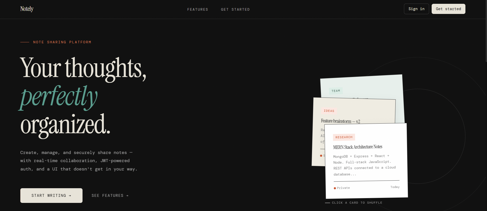
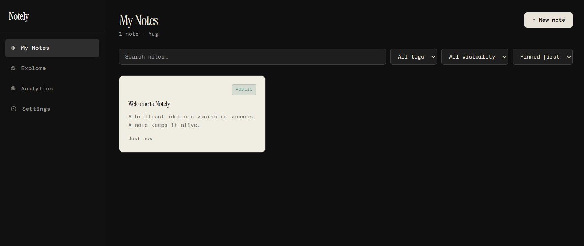

# Notely

> A full-stack MERN note-sharing application with real-time collaboration, AI summaries, version history, and offline support.

[](https://notely-gules-three.vercel.app/)


🔗 **[https://notely-notes-three.vercel.app/](https://notely-notes-three.vercel.app/)**

---

## Screenshots




---

## Table of Contents

- [Features](#features)
- [Tech Stack](#tech-stack)
- [Project Structure](#project-structure)
- [Prerequisites](#prerequisites)
- [Local Development](#local-development)
- [Environment Variables](#environment-variables)
- [API Reference](#api-reference)
- [Security Model](#security-model)
- [Production Deployment](#production-deployment)
- [Pre-Launch Checklist](#pre-launch-checklist)
- [Known Limitations](#known-limitations)
- [License](#license)

---

## Features

- **Auth** — JWT access + refresh tokens, bcrypt password hashing, per-tab session (closing a tab ends the session; a new tab requires login)
- **Notes** — create, edit, delete, pin, color-tag, full-text search
- **Collaboration** — real-time co-editing via Socket.io, live cursors
- **Sharing** — public links, revocable share tokens, per-user read/write permissions
- **AI summaries** — note summarization via Google Gemini
- **Attachments** — file uploads to local disk (dev) or Cloudinary (prod)
- **Version history** — snapshot, view, and restore previous note versions
- **Export** — download notes as PDF or DOCX
- **Analytics** — per-note view tracking, dashboard stats
- **PWA** — offline banner, service-worker caching, queued mutations when offline
- **Dark mode** — system-aware with manual override

---

## Tech Stack

| Layer        | Technology                                 |
| ------------ | ------------------------------------------ |
| Frontend     | React 18, Vite, Tailwind CSS               |
| Backend      | Node.js, Express 5, Socket.io              |
| Database     | MongoDB (Atlas) + Mongoose                 |
| Auth         | JWT (`jsonwebtoken`) + `bcryptjs`          |
| AI           | Google Gemini API                          |
| File storage | Cloudinary (prod) / local disk (dev)       |
| Sanitization | DOMPurify (client-side markdown rendering) |

---

## Project Structure

```
notely/
├── client/                   # React + Vite frontend
│   ├── public/sw.js          # Service worker (offline support)
│   └── src/
│       ├── components/       # UI components (Notes, Auth, Layout, Landing, …)
│       ├── context/          # AuthContext, NotesContext, ThemeContext
│       ├── hooks/            # useAiSummary, useCollaboration, useOffline, …
│       ├── pages/            # auth/, dashboard/, shared/
│       ├── services/         # api.js, authService.js, notesService.js
│       ├── utils/            # tokenStorage.js, registerSW.js
│       └── styles/
└── server/                   # Node.js + Express backend
    ├── config/db.js          # MongoDB connection
    ├── controllers/          # auth, notes, share, ai, upload, version, export, analytics
    ├── middleware/            # auth (JWT), validate (express-validator), errorHandler
    ├── models/                # User, Note
    ├── routes/
    ├── sockets/               # collaborationSocket.js
    └── server.js
```

---

## Prerequisites

- Node.js 18+ and npm
- A MongoDB connection string (local `mongod` or [MongoDB Atlas](https://www.mongodb.com/atlas))
- (Optional) [Google Gemini API key](https://aistudio.google.com/app/apikey) for AI summaries
- (Optional) [Cloudinary](https://cloudinary.com/) account for production file storage

---

## Local Development

### 1. Backend

```bash
cd server
npm install
cp .env.example .env        # fill in your values
npm run dev                 # starts with nodemon
```

API runs at `http://localhost:5000`. Check `http://localhost:5000/api/health` to confirm MongoDB is connected.

### 2. Frontend

```bash
cd client
npm install
cp .env.example .env        # set VITE_API_URL
npm run dev
```

App runs at `http://localhost:5173`.

---

## Environment Variables

Neither `.env` file is committed — create them locally from the `.env.example` files. **Never commit real secrets.**

### `server/.env`

| Variable                   | Required  | Description                                                                                          |
| -------------------------- | --------- | ---------------------------------------------------------------------------------------------------- |
| `MONGODB_URI`              | ✅         | MongoDB connection string                                                                            |
| `JWT_SECRET`               | ✅         | ≥32 random chars. Generate: `openssl rand -base64 48`                                               |
| `JWT_REFRESH_SECRET`       | ✅         | Must differ from `JWT_SECRET`, same length requirement                                               |
| `JWT_EXPIRES_IN`           | optional  | Access token lifetime (default `7d`)                                                                 |
| `JWT_REFRESH_EXPIRES_IN`   | optional  | Refresh token lifetime (default `30d`)                                                               |
| `CLIENT_URL`               | ✅ in prod | Your deployed frontend origin for CORS (e.g. `https://notely-gules-three.vercel.app`)               |
| `PORT`                     | optional  | API port (default `5000`)                                                                            |
| `NODE_ENV`                 | ✅ in prod | Set to `production`                                                                                  |
| `GEMINI_API_KEY`           | optional  | Enables `/api/ai/summarise`. Omitted → endpoint returns 503                                          |
| `CLOUDINARY_URL`           | optional  | `cloudinary://<key>:<secret>@<cloud_name>`. Without this, attachments use local disk (not prod-safe) |
| `ATTACHMENT_ALLOWED_HOSTS` | optional  | Extra hostnames for PDF export image embedding (SSRF allowlist)                                      |
| `EMAIL_HOST`               | optional  | SMTP host (e.g. `smtp.gmail.com`). Omitted → share notifications skipped silently                   |
| `EMAIL_PORT`               | optional  | SMTP port (default `587`)                                                                            |
| `EMAIL_SECURE`             | optional  | `true` for port 465 TLS                                                                              |
| `EMAIL_USER`               | optional  | SMTP login / sender address                                                                          |
| `EMAIL_PASS`               | optional  | SMTP password. For Gmail: use an App Password                                                        |

### `client/.env`

| Variable       | Required | Description                                                               |
| -------------- | -------- | ------------------------------------------------------------------------- |
| `VITE_API_URL` | ✅        | Base URL of the API, e.g. `http://localhost:5000/api` (dev) or prod URL   |

---

## API Reference

All responses follow `{ success: boolean, message: string, data?: any, errors?: any[] }`.

| Method      | Path                                     | Auth | Description                                        |
| ----------- | ---------------------------------------- | ---- | -------------------------------------------------- |
| POST        | `/api/auth/register`                     | —    | Register                                           |
| POST        | `/api/auth/login`                        | —    | Login                                              |
| POST        | `/api/auth/refresh`                      | —    | Exchange refresh token for new access token        |
| GET         | `/api/auth/profile`                      | ✅    | Current user profile                               |
| PUT         | `/api/auth/profile`                      | ✅    | Update username/avatar                             |
| GET         | `/api/notes`                             | ✅    | List own notes (paginated, searchable, filterable) |
| GET         | `/api/notes/public`                      | —    | Browse public notes                                |
| GET         | `/api/notes/shared/:token`               | —    | View a note by its public share token              |
| POST        | `/api/notes`                             | ✅    | Create note                                        |
| GET         | `/api/notes/:id`                         | ✅    | Get note (owner, shared user, or public)           |
| PUT         | `/api/notes/:id`                         | ✅    | Update note (owner only)                           |
| DELETE      | `/api/notes/:id`                         | ✅    | Delete note (owner only)                           |
| POST        | `/api/notes/:id/share`                   | ✅    | Generate/revoke public share token                 |
| GET/POST    | `/api/notes/:id/share-with`              | ✅    | List/add collaborators by email                    |
| DELETE      | `/api/notes/:id/share-with/:userId`      | ✅    | Revoke a collaborator                              |
| POST/DELETE | `/api/notes/:id/attachments[/:attId]`    | ✅    | Upload/delete attachment                           |
| GET/POST    | `/api/notes/:id/versions`               | ✅    | List/create version snapshot                       |
| POST        | `/api/notes/:id/versions/:verId/restore` | ✅    | Restore a version                                  |
| GET         | `/api/notes/:id/export?format=pdf\|docx`| ✅    | Export note                                        |
| POST        | `/api/ai/summarise`                      | ✅    | AI summary of a note                               |
| GET         | `/api/analytics/dashboard`               | ✅    | Dashboard stats                                    |
| POST        | `/api/analytics/notes/:id/view`          | —    | Record a note view                                 |
| GET         | `/api/health`                            | —    | Liveness + DB connection status                    |

---

## Security Model

- **Passwords** — bcrypt, 12 salt rounds, never returned from queries (`select: false`)
- **Tokens** — short-lived JWT access + longer-lived refresh token, both independently validated; server refuses to start with weak/missing secrets
- **Session scope** — tokens in `sessionStorage`: per-tab isolation, closing a tab ends the session
- **Access control** — every mutation re-checks ownership or collaborator permission server-side
- **Rate limiting** — global limiter, tighter on `/auth`, `/ai`, and `/export`
- **SSRF protection** — PDF export image fetching uses an explicit hostname allowlist; private/link-local IPs always blocked
- **Path traversal** — local-disk attachment deletion validates resolved path stays inside uploads root
- **XSS** — markdown content escaped and run through DOMPurify; link targets restricted to `http(s):`/`mailto:`
- **Upload restrictions** — `image/svg+xml` excluded (SVGs can embed scripts)
- **Headers** — `helmet` applied; CORS locked to configured origin with credentials

---

## License

MIT — see [LICENSE](./LICENSE)
